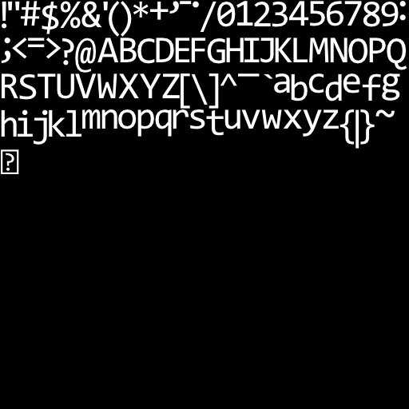

# mv_easy_font

Simple font renderer library written in Opengl 3.3 using `stb_truetype.h` to load a packed bitmap into texture of a .ttf font. 

Uses instanced rendering, so that only position, index and color of each glyph have to be updated instead of updating two triangles of vertex attributes per glyph. 

Inspired by `stb_easy_font.h`.

### Usage
Compile the example program with 
```bash
gcc main.c -Iinclude -lglfw -lm
```
or similar linking options for your OS (like -ldl in linux). Run with:
```
./a.out path/to/font.ttf
```
or omit the file to use `extra/Inconsolata-Regular.ttf`.

To use `mv_easy_font.h` in any running opengl project, `#define MV_EASY_FONT_IMPLEMENTATION` before including `mv_easy_font.h` in one .c/.cpp file, and include `mv_easy_font.h` wherever else needed. Simply call `mv_ef_draw()` with the appropriate parameters to draw text:
```C
mv_ef_draw(str, col, offset, font_size, res);
```

If `mv_ef_init(path_to_ttf, font_size, path_to_custom_vertex_shader, path_to_custom_fragment_shader);` is not called manually, `extra/Inconsolata-Regular.ttf` will be used with a font size of 48, and the built in shaders are used. 

### Dependencies

`mv_easy_font.h` depends on `stb_truetype.h` and calls the OpenGL API, so make sure all the relevant OpenGL symbols and functions are loaded using something like GLEW, GLAD or whatever floats your boat.

You can optionally choose to use include `stb_image_write.h` (for generating font.png) and `stb_rect_pack.h` (for more efficient packing)

At the moment there are two shader files that need to be visible to the executable. These will probably be inlined in the near future.

console.ttf is hardcoded at the moment, so that will also have to be available in the current working directory when running.

The example code uses GLFW and GLAD, but those should not be required, as long as opengl symbols are loaded properly.

### TODO

- ADd functionality to adjust the bitmap texture size based on the font size. currently it's using a 512x256 texture. 

- Look into padding in the bitmap

### Screenshot:


### Font bitmap


